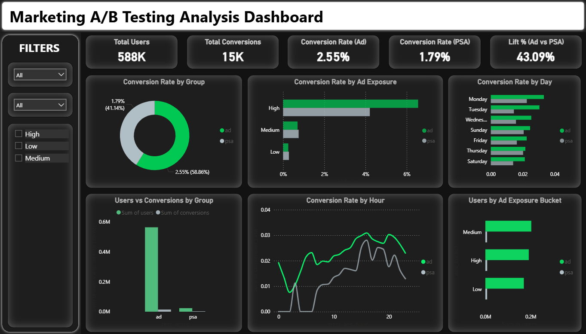
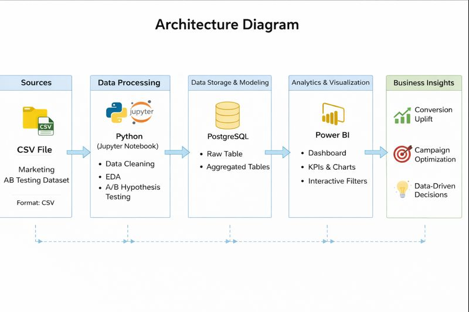
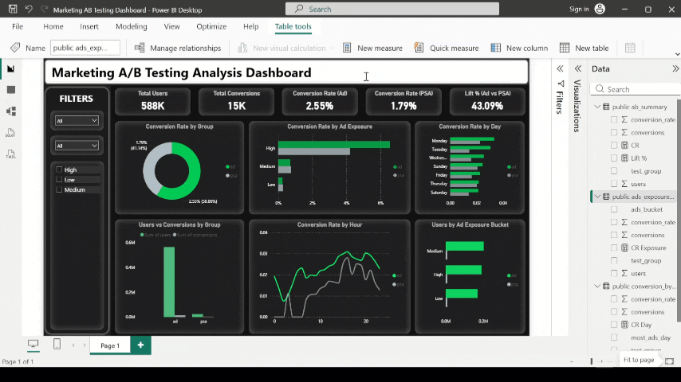
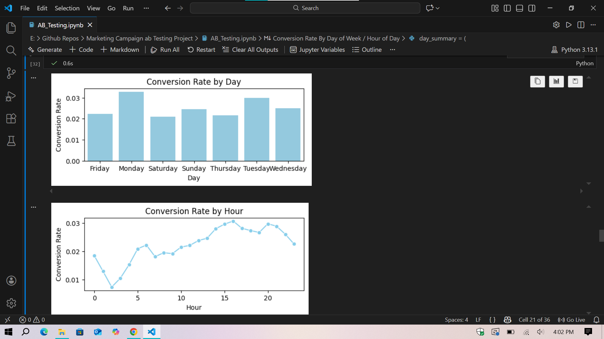
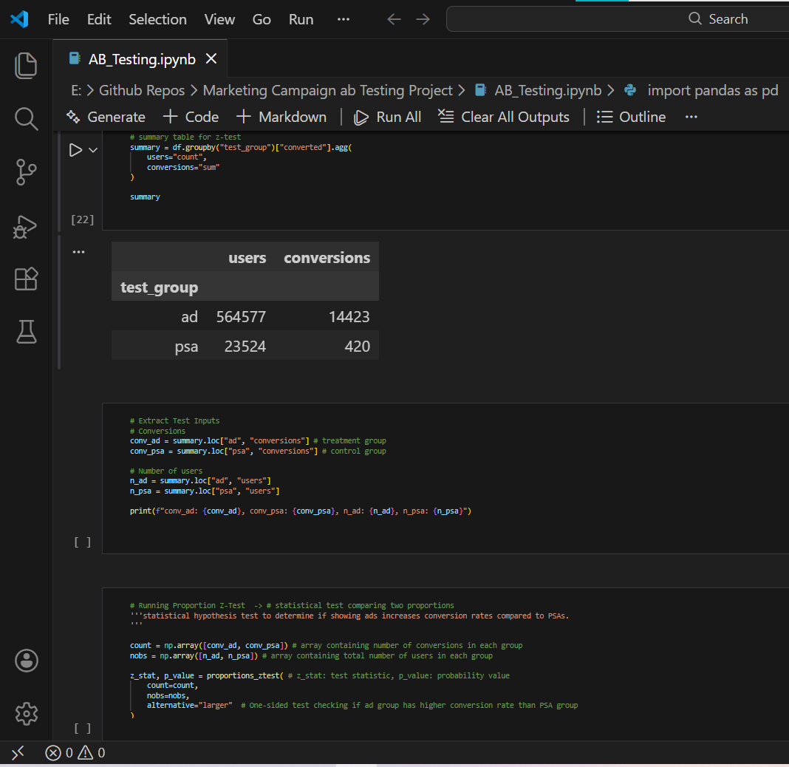
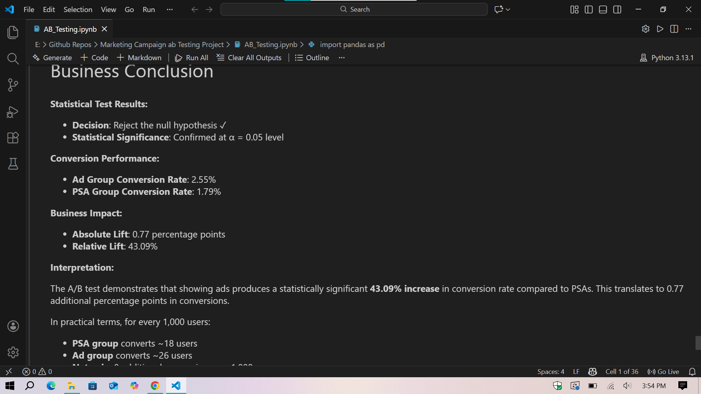

# A/B Testing — Marketing Analysis (End‑to‑End)

An end‑to‑end **A/B testing** project evaluating marketing campaign performance using **Python**, **PostgreSQL**, and **Power BI**—delivering **statistically significant** results, business conclusions, and an interactive dashboard.

---

## 🧠 Business Question

**Does showing ads to users increase conversion rate compared to showing a PSA (control)?**

- **Control group:** `psa`
- **Treatment group:** `ad`

---

## ✅ Key Results

- **Conversion Rate (Ad):** **0.02555**  
- **Conversion Rate (PSA):** **0.01785**
- **Absolute Lift:** **0.00769**
- **Relative Lift:** **~43.09%**
- **Z‑test:** **Z = 7.37**, **p-value ≈ 8.53e‑14** → **Reject H₀**

**Conclusion:** The **Ad** group converts **significantly better** than the **PSA** group at α = **0.05**.

---

## 📊 Dashboard Preview



> Demo: `ab_testing_demo.gif`  
> Charts: `ab_testing_charts.png`

---

## 🏗️ Architecture



---
## Dashboard Demo


## Sample Charts




---

## 🧰 Tech Stack

- **Python** (EDA + hypothesis testing)
- **PostgreSQL** (data modeling + summary tables)
- **Power BI** (interactive reporting)
- Libraries: **pandas**, **numpy**, **seaborn**, **matplotlib**, **statsmodels**

---

## 📁 Dataset (Included)

- `marketing_ab_raw_dataset.csv` — raw dataset  
- `marketing_ab_clean.csv` — cleaned dataset used for analysis/pipeline

Dataset fields used:
- `test_group` (ad / psa)
- `converted` (boolean)
- `total_ads`
- `most_ads_day`
- `most_ads_hour`

---

## 🚀 Step-by-Step: Run the Project End‑to‑End

### Step 1 — Review experiment setup
Open the notebook:
- `AB_Testing.ipynb`

It validates:
- group distribution (`ad` vs `psa`)
- conversion distribution
- null/duplicate checks
- standardized column names (**snake_case**)

### Step 2 — Run Python cleaning + EDA
In `AB_Testing.ipynb`, the workflow includes:
- loading raw data
- dropping unused columns (e.g., `Unnamed: 0`)
- renaming columns → **snake_case**
- data quality checks (nulls, duplicates)
- EDA:
  - group size distribution
  - conversion rate comparison
  - ad exposure distribution (`total_ads`)
  - conversion patterns by **day** and **hour**

> Note: if the notebook uses a local Windows path, update it to the repo CSV path:
> - `marketing_ab_raw_dataset.csv`

### Step 3 — Run hypothesis testing (Z‑test)
The notebook performs a **one‑sided proportions z-test**:

- **H₀:** conversion(ad) = conversion(psa)  
- **H₁:** conversion(ad) > conversion(psa)  
- **α = 0.05**

Outputs include:
- **p‑value**
- decision rule (**Reject / Fail to reject H₀**)
- **absolute & relative lift**

### Step 4 — Build the PostgreSQL analytics layer (optional but recommended)
Run:
- `ab testing postgreSQL Pipeline.sql`

This script creates:
- `marketing_ab_clean` (table)
- `ab_summary` (overall users, conversions, conversion_rate)
- `conversion_by_day`
- `conversion_by_hour`
- `ads_exposure_summary` (Low/Medium/High buckets)

### Step 5 — Open the Power BI dashboard
Open:
- `AB Testing Marketing Analysis Dashboard.pbix`

Then:
1. If prompted, update the data source connection (CSV or PostgreSQL).
2. Click **Refresh**.

### Step 6 — Read the final business takeaway


---

## 📌 What’s Included (Deliverables)

- **Notebook:** `AB_Testing.ipynb` (full EDA + statistical testing)
- **SQL pipeline:** `ab testing postgreSQL Pipeline.sql` (summary tables for BI)
- **Power BI dashboard:** `AB Testing Marketing Analysis Dashboard.pbix`
- **Visuals:** charts, hypothesis testing screenshot, and business conclusion image

---

## 🗂️ Repository Structure

```
.
├── README.md
├── AB_Testing.ipynb
├── ab testing postgreSQL Pipeline.sql
├── marketing_ab_raw_dataset.csv
├── marketing_ab_clean.csv
├── AB Testing Marketing Analysis Dashboard.pbix
├── architecture_diagram.png
├── hypothesis_testing.png
├── ab_testing_charts.png
├── ab_testing_dashboard.png
├── ab_testing_demo.gif
└── business_conclusion.png
```
